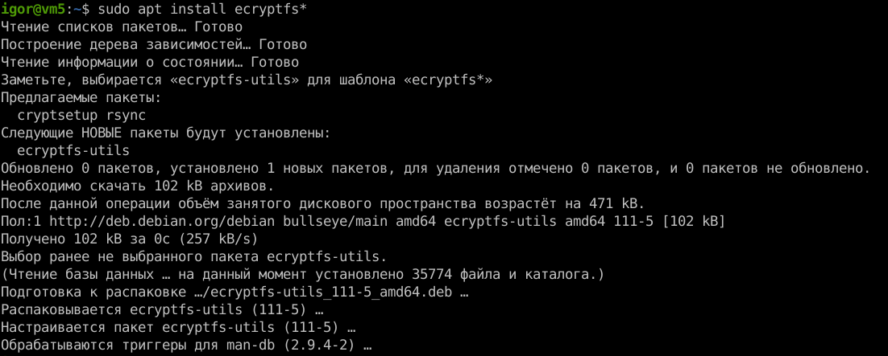
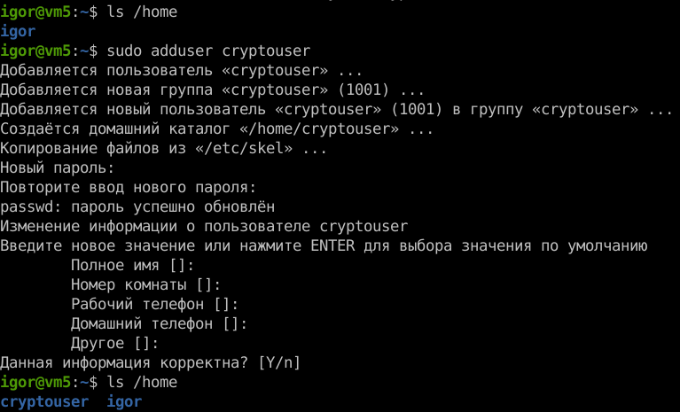
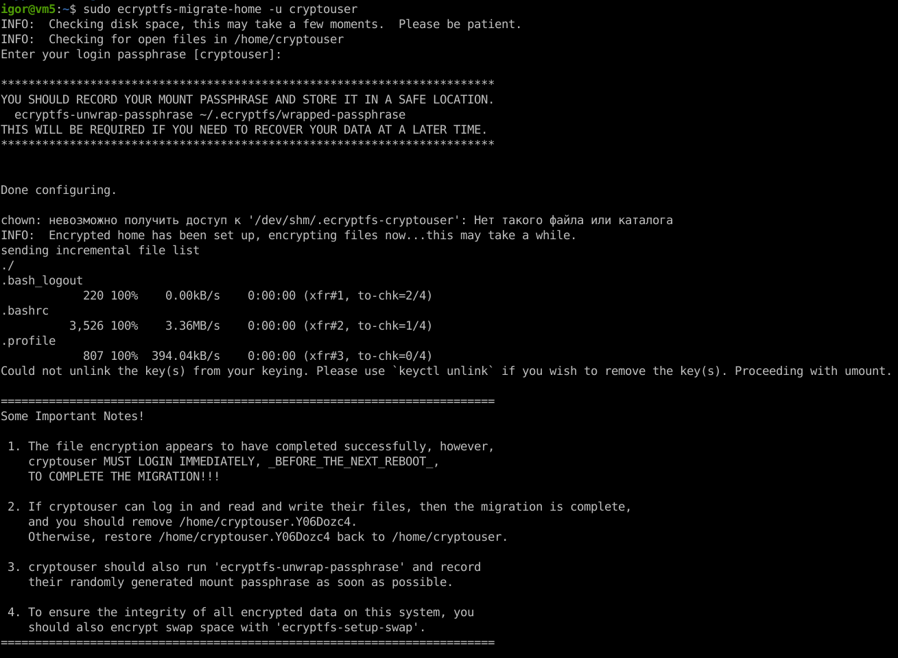
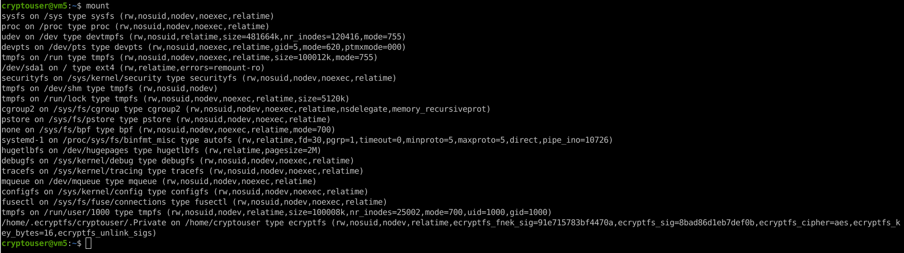
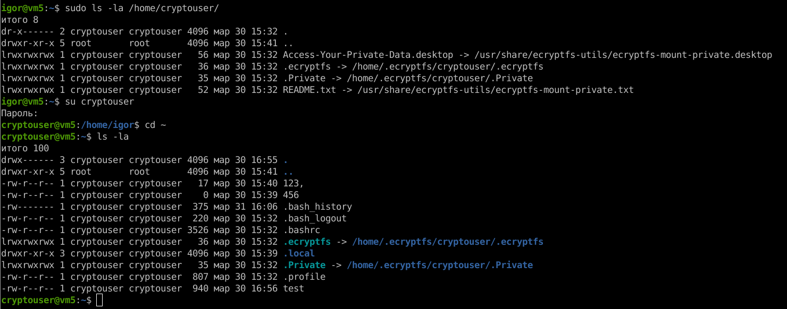
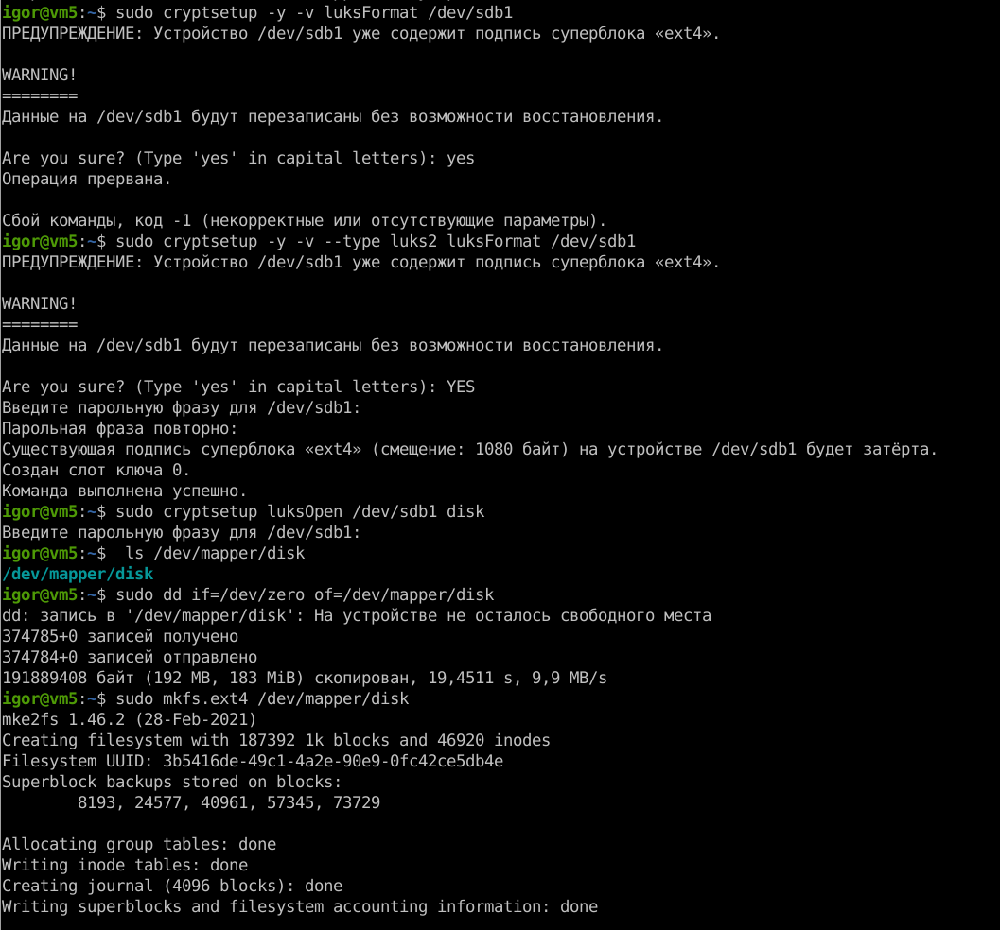
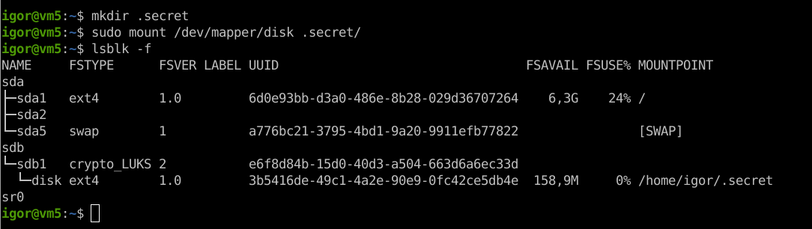

# Домашнее задание к занятию "`13.2. «Защита хоста»`" - `Живарев Игорь`

### Задание 1

Устанавливаем ecryptfs-utils:

Создаём пользователя cryptuser:

Мигрируем и шифруем домашний каталог пользователя cryptouser:

Домашний каталог пользователя зашифрован:

Второй пользователь не имеет доступа к данным:

---

### Задание 2

Создание раздела LUKS:

Монтирование раздела:

---
